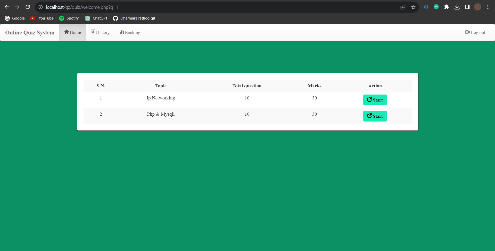

# PHP Quiz Application

Engage your audience with a dynamic PHP-powered Quiz Application that offers interactive quizzes and instant feedback.

## Features

- Create custom quizzes with multiple-choice questions.
- Interactive user interface for seamless quiz-taking.
- Instant feedback and scoring.
- Easy customization for various topics.

## Screenshots

## Getting Started

1. Clone the repository: `git clone https://github.com/Dharmarajrathod/php-quiz-app.git`
2. Set up a local web server environment (e.g., XAMPP, WAMP, or MAMP).
3. Copy the project files to your web server directory.
4. Access the app through your web browser.

## Usage

1. Create a new quiz by adding questions and answers.
2. Share the quiz link with participants.
3. Participants take the quiz, receive instant feedback, and see their scores.

## Contribution

Contributions are welcome! If you encounter issues or have suggestions, feel free to submit issues and pull requests.

## About the Author

This project was created by Dharmaraj Rathod. Connect with me on [GitHub](https://github.com/Dharmarajrathod) for more projects and collaborations.
